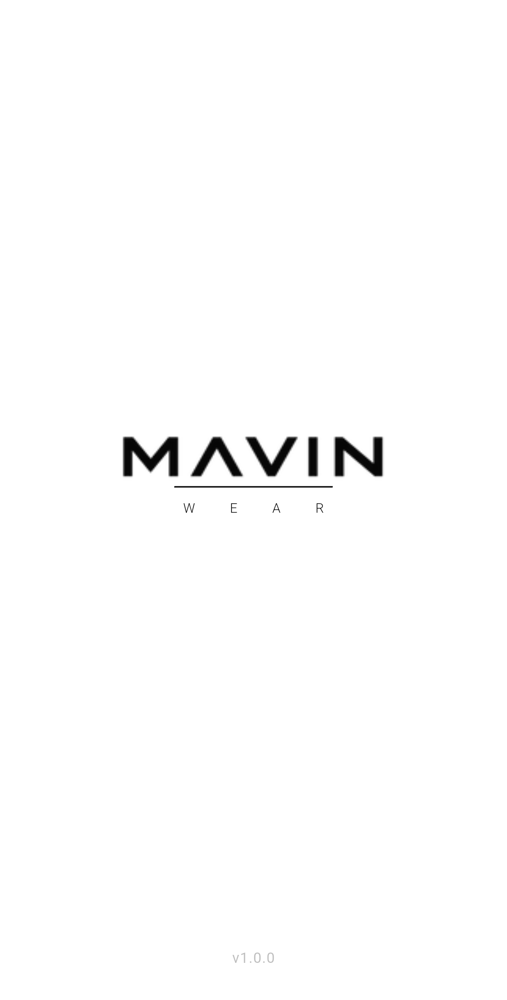
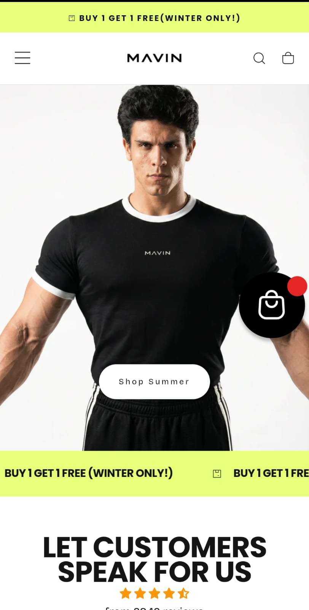
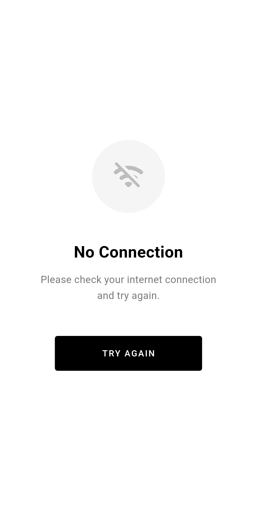

<div align="center">

# 🧥 Mavin Wear

**Android WebView Application**

[](https://flutter.dev)
[](https://dart.dev)
[](https://developer.android.com)
[](LICENSE)

A lightweight, high-performance Android app that wraps the [Mavin Wear](https://www.mavin-wear.com) e-commerce website using Flutter WebView — delivering a native app experience without rebuilding the existing website.

[🌐 Live Website](https://www.mavin-wear.com) · [📦 Download APK](#-download) · [🐛 Report Bug](../../issues)

</div>

---

## 📱 Screenshots

<div align="center">

| Splash Screen | Home Screen | Offline State |
|:---:|:---:|:---:|
|  |  |  |
| *Animated Brand Intro* | *Full E-commerce Web* | *Clean Error Handling* |

</div>

---

## ✨ Features

- 🌐 **Full WebView** — Loads `https://www.mavin-wear.com` with full JavaScript support
- 🖼️ **Splash Screen** — Animated brand logo with fade + scale transition
- 🔙 **Smart Back Navigation** — Goes back in browser history; shows exit dialog at root
- 📶 **Offline Detection** — Real-time connectivity monitoring with a polished "No Connection" screen
- 🔄 **Pull to Refresh** — Swipe down anywhere to reload the current page
- 🔗 **Smart Link Handling** — Internal links open inside the app; external links handled separately
- 📊 **Loading Indicator** — Linear progress bar shows page load progress
- 🎨 **Black & White Theme** — Minimal, premium aesthetic matching the brand identity
- 🔒 **HTTPS Only** — `usesCleartextTraffic="false"` enforced for security

---

## 🛠️ Tech Stack

| Layer | Technology |
|---|---|
| Framework | [Flutter](https://flutter.dev) 3.38+ |
| Language | Dart 3.11+ |
| WebView Engine | [`webview_flutter`](https://pub.dev/packages/webview_flutter) 4.13.1 |
| Connectivity | [`connectivity_plus`](https://pub.dev/packages/connectivity_plus) 6.1.5 |
| Min Android SDK | API 21 (Android 5.0 Lollipop) |
| Target Android SDK | API 35 |

---

## 📂 Project Structure

```
mavin_wear/
├── android/
│   └── app/
│       ├── build.gradle.kts          # App-level Gradle config (package name, SDK versions)
│       └── src/main/
│           └── AndroidManifest.xml   # Permissions & app metadata
├── assets/
│   ├── logo.png                      # Brand logo used in Splash Screen
│   └── icon.png                      # App icon source
├── lib/
│   └── screens/
│       ├── splash_screen.dart        # Animated splash screen with connectivity check
│       ├── home_screen.dart          # Main WebView screen with back nav & refresh
│       └── no_internet_screen.dart   # Offline fallback screen with retry logic
│   └── main.dart                     # App entry point & theme configuration
├── test/
│   └── widget_test.dart              # Basic smoke test
├── pubspec.yaml                      # Dependencies & asset declarations
└── build_apk.bat                     # Windows helper script to build release APK
```

---

## 🚀 Getting Started

### Prerequisites

Make sure you have the following installed:

- [Flutter SDK](https://docs.flutter.dev/get-started/install) (3.38 or higher)
- [Android Studio](https://developer.android.com/studio) with Android SDK
- [Git](https://git-scm.com/downloads)
- A connected Android device or emulator

Verify your setup:
```bash
flutter doctor
```

### Installation

1. **Clone the repository**
   ```bash
   git clone https://github.com/YOUR_USERNAME/mavin_wear.git
   cd mavin_wear
   ```

2. **Install dependencies**
   ```bash
   flutter pub get
   ```

3. **Run on a device or emulator**
   ```bash
   flutter run
   ```

---

## 📦 Building

### Debug APK (for testing)
```bash
flutter build apk --debug
```
Output: `build/app/outputs/flutter-apk/app-debug.apk`

### Release APK (for distribution)
```bash
flutter build apk --release
```
Output: `build/app/outputs/flutter-apk/app-release.apk`

### App Bundle (for Google Play Store)
```bash
flutter build appbundle --release
```
Output: `build/app/outputs/bundle/release/app-release.aab`

> **Windows shortcut:** Double-click `build_apk.bat` to automatically resolve the git PATH and build the release APK.

---

## ⚙️ App Configuration

| Setting | Value |
|---|---|
| App Name | Mavin Wear |
| Package Name | `com.mavinwear.app` |
| Version | 1.0.0+1 |
| Min SDK | API 21 (Android 5.0) |
| Target SDK | API 35 |
| Orientation | Portrait only |
| Website URL | `https://www.mavin-wear.com` |

---

## 🔑 Permissions

| Permission | Reason |
|---|---|
| `INTERNET` | Load the website in WebView |
| `ACCESS_NETWORK_STATE` | Detect connection status for offline screen |

---

## 📱 How It Works

```
App Launch
    │
    ▼
SplashScreen (2.5s)
    │
    ├── Has Internet? ──YES──▶ HomeScreen (WebView)
    │                               │
    │                               ├── Page loads normally
    │                               ├── Internal links → stay in app
    │                               ├── External links → handled separately
    │                               ├── Connection lost → NoInternetScreen
    │                               └── Back button → browser history / exit dialog
    │
    └── No Internet? ──▶ NoInternetScreen
                              │
                              └── Retry → has internet? → HomeScreen
```

---

## 🎨 Design Decisions

- **WebView over Native UI**: The Mavin Wear website is already fully responsive, so wrapping it in a WebView delivers the same visual experience without duplicating any design work.
- **Black & White palette**: Keeps the app shell consistent with the brand's minimalist aesthetic.
- **`SafeArea(bottom: false)`**: Allows the WebView to extend behind the bottom navigation bar for a more immersive feel.
- **`PopScope` with exit dialog**: Provides the expected Android back-navigation behavior while preventing accidental exits.
- **`connectivity_plus`** instead of deprecated `connectivity`: Ensures compatibility with modern Android Gradle Plugin versions.

---

## 🐛 Known Issues & Notes

- **External URL handling**: The `_launchExternalUrl()` method is a stub. To open external links in the browser, add the [`url_launcher`](https://pub.dev/packages/url_launcher) package and implement it.
- **Cookie persistence**: WebView sessions persist across app restarts (handled by the OS).
- **Mixed content**: `usesCleartextTraffic="false"` is set — if the website ever loads HTTP sub-resources, they will be blocked.

---

## 🔮 Future Improvements

- [ ] Implement `url_launcher` for opening external links in the browser
- [ ] Add Firebase Analytics for page-view tracking
- [ ] Add Push Notifications support
- [ ] Implement deep link support (e.g., `mavinwear://product/123`)
- [ ] Add a custom user-agent string to identify the app in server analytics
- [ ] Generate proper release signing keystore for production builds

---

## 📄 License

This project is licensed under the MIT License — see the [LICENSE](LICENSE) file for details.

---

<div align="center">

Made with ❤️ for **Mavin Wear** · [mavin-wear.com](https://www.mavin-wear.com)

</div>
